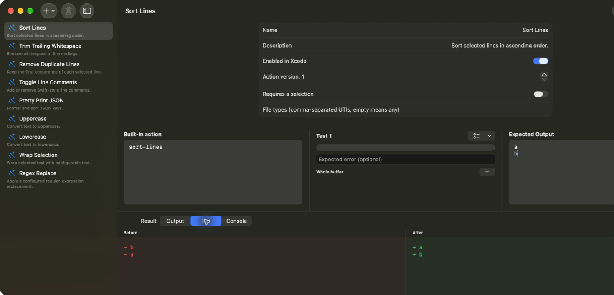

# EditSmith

[](https://github.com/everettjf/editsmith)
[](https://discord.gg/eGzEaP6TzR)
[](#requirements)
[](LICENSE)



[Website](https://xnu.app/editsmith/) · [GitHub](https://github.com/everettjf/editsmith) · [Discord](https://discord.gg/eGzEaP6TzR)

**Programmable text actions for Xcode.** EditSmith is a native SwiftUI workbench for creating deterministic JavaScript actions or prompt-driven model actions, testing them against realistic Xcode selections, and running enabled actions from Xcode's Editor menu.

## Why EditSmith

- **Stay inside Xcode.** Run named text actions from the Editor menu without moving source to another app.
- **Make transformations repeatable.** Save a JavaScript recipe once and reuse it across projects.
- **Test before enabling.** Verify output, selections, expected errors, diffs, and console logs in the app.
- **Move actions safely.** Duplicate actions or import and export a versioned JSON archive; imported actions start disabled.
- **Choose the execution engine.** Use sandboxed JavaScript for deterministic transforms, Apple Foundation Models for private on-device assistance, or an explicitly configured model provider.
- **Start with useful actions.** Sorting, deduplication, comments, wrapping, regex replacement, whitespace cleanup, JSON formatting, and case conversion are included.
- **Make text worth sharing.** Creative Lab includes 15 built-in transformations such as leetspeak, fullwidth, circled text, Unicode monospace, Zalgo, Morse, binary, ASCII boxes, and banners.
- **Draft with Apple Intelligence.** On macOS 26 or later, optionally generate a local JavaScript draft, then test and enable it yourself.

## Quick start

1. Build and launch EditSmith once.
2. Open System Settings → Privacy & Security → Extensions → Xcode Source Editor and enable EditSmith.
3. Create or enable a recipe in EditSmith, then save it.
4. In Xcode, select text and choose Editor → EditSmith → your recipe.

## Recipe model

Each recipe is a versioned action with applicability rules, parameters, test fixtures, and an execution-engine kind. JavaScript actions define a `transform(input)` function that returns replacement text. Model actions define a prompt template and provider configuration. Both engines replace only the Xcode selections when selections are present, otherwise they transform the full buffer.

Script execution has input, source, output, and one-second runtime limits. The workbench supports multiple fixtures, Xcode-style selection ranges, expected output and errors, snapshot updates, output diffs, console logs, source-located JavaScript diagnostics, duplication, and versioned JSON import/export.

## Model actions

The built-in model gallery contains ten editable examples for explaining code, improving names, writing documentation, translating prose, repairing grammar, generating tests, reviewing security, simplifying code, converting formats, and creating commit-message text.

- **Apple On-Device** uses the Foundation Models framework on supported Macs.
- **Apple Private Cloud Compute** is available on supported OS versions and eligible developer accounts. Text selected for that action is processed according to Apple's PCC service behavior.
- **Ollama / Local LLaMA** targets a user-configured Ollama endpoint such as `http://127.0.0.1:11434`. The sandboxed app and extension also require the outgoing-network entitlement; builds without that entitlement show the configuration but cannot connect.

The Source Editor Extension is the bridge: XcodeKit supplies the current buffer and selection ranges, EditSmith runs the chosen JavaScript or model engine, then the extension writes back the transformed text and updated selections.

Model actions are explicit and remain testable in the workbench. Deterministic JavaScript actions never invoke a model. Generated drafts and imported actions start disabled until the user tests and enables them.

## Requirements

- macOS 15 or later
- A supported Xcode installation
- XcodeGen when regenerating the checked-in project

## Develop and verify

```sh
xcodegen generate --spec project.yml
cd Core && swift test && cd ..
xcodebuild test -project EditSmith.xcodeproj -scheme EditSmith \
  -destination 'platform=macOS' CODE_SIGNING_ALLOWED=NO
```

The app and Source Editor Extension are implemented in Swift. The core has no third-party dependencies.

Before publishing a build, follow the [release checklist](RELEASE_CHECKLIST.md).
The repository also includes a repeatable `scripts/verify-release.sh` gate and
the current [release notes](RELEASE_NOTES.md).

## Privacy

Recipe source, configuration, and fixtures stay on the Mac. JavaScript and Apple On-Device actions process text locally. A user-invoked PCC or Ollama action may send only the selected text—or the full buffer when there is no selection—to its configured provider. Builds without the outgoing-network entitlement cannot connect to Ollama. See the [privacy policy](https://xnu.app/editsmith/privacy.html).

## License

[MIT](LICENSE)
