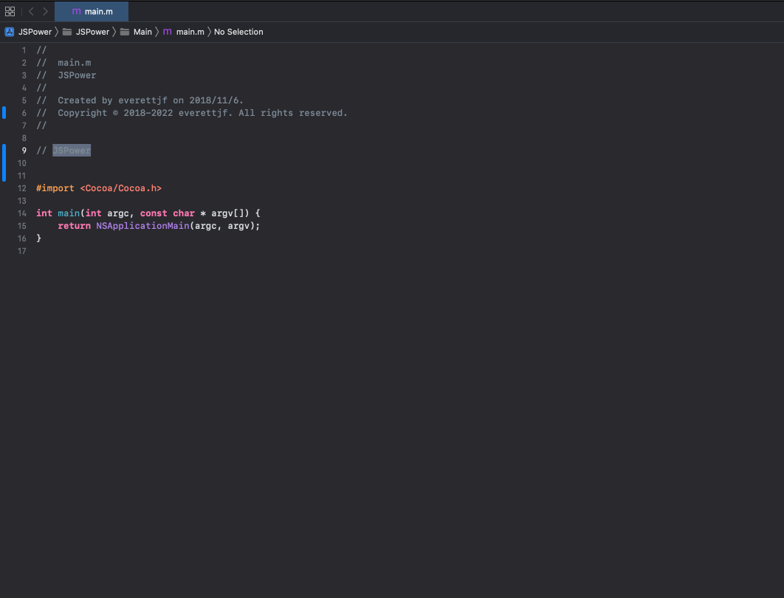
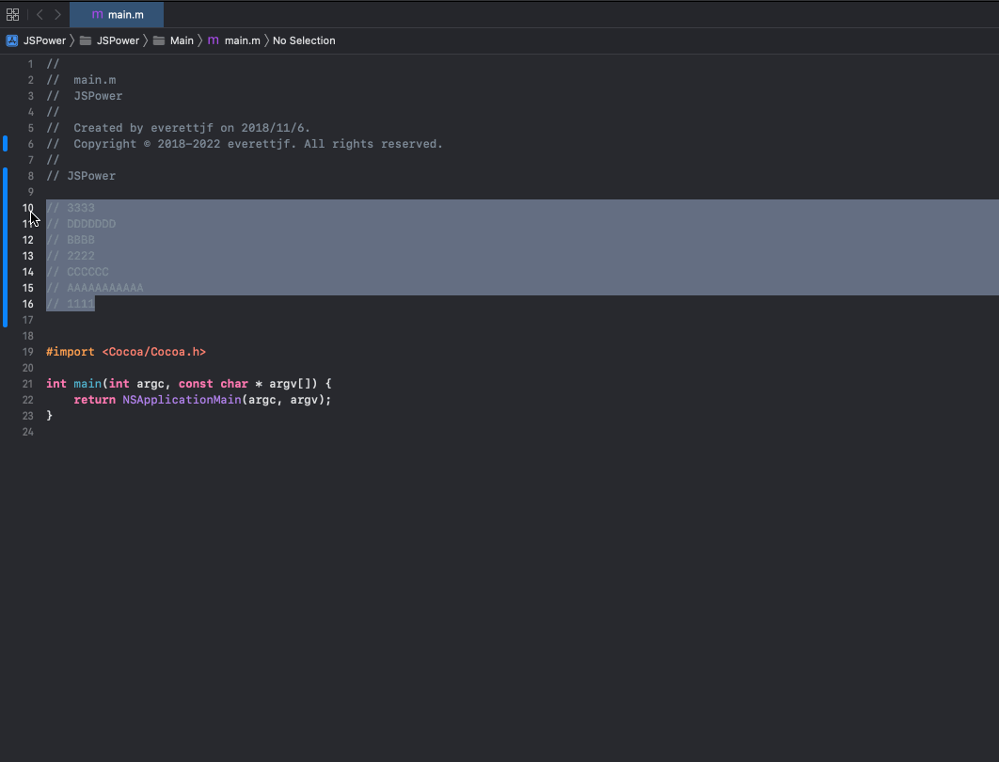

# JSPower

[](https://github.com/everettjf/jspowerxcode)
[](https://discord.gg/eGzEaP6TzR)
[](#requirements)
[](LICENSE)

JSPower is a Swift and SwiftUI text-automation workbench for Xcode. Create local JavaScript recipes, test them against sample input, and run enabled recipes from Xcode's Editor menu. Built-in recipes cover line sorting, trailing-whitespace cleanup, JSON formatting, and case conversion.

| Transform selected text | Sort lines from Xcode |
| --- | --- |
|  |  |

## Why JSPower

- **Stay inside Xcode.** Run enabled recipes from the Editor menu without moving source text to a browser or another editor.
- **Make transformations repeatable.** Save a JavaScript recipe once, test it against sample input, and reuse it across projects.
- **Keep source local.** Recipes run in JavaScriptCore and receive only the text XcodeKit passes to the extension.
- **Start with useful defaults.** Sorting, whitespace cleanup, JSON formatting, and case conversion are included.

## Quick start

1. Build and launch JSPower once.
2. Open System Settings → Privacy & Security → Extensions → Xcode Source Editor and enable JSPower.
3. Create or enable a recipe in JSPower.
4. In Xcode, select text and choose Editor → JSPower → your recipe.

## Recipe model

Each recipe is local JavaScript that transforms the selected text. Use the in-app sample input to verify the result before enabling the recipe for Xcode. Recipes have no network access through the app.

## Requirements

- macOS with a supported Xcode installation
- XcodeGen for regenerating the checked-in project
- Swift toolchain compatible with the checked-in project

The 2.0 app and Source Editor Extension are implemented entirely in Swift. CocoaPods, AFNetworking, YYModel, remote package downloads, and the Objective-C runtime implementation are no longer part of the build.

Recipes execute locally in JavaScriptCore and receive only the text supplied by XcodeKit. The app has no network entitlement.

## Develop and verify

The checked-in Xcode project is generated from `project.yml`:

```sh
xcodegen generate --spec project.yml
cd Core && swift test && cd ..
xcodebuild -project JSPower.xcodeproj -scheme JSPower -destination 'platform=macOS' CODE_SIGNING_ALLOWED=NO build
```

Enable the extension in System Settings → Privacy & Security → Extensions → Xcode Source Editor.

## Privacy

JSPower has no network entitlement. Recipe source and configuration stay on the Mac, and the Source Editor Extension processes only text supplied by XcodeKit.

## License

[MIT](LICENSE)
